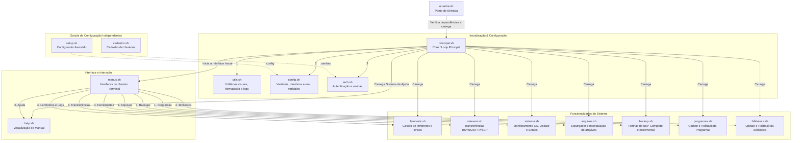

# Organograma do Sistema SAV (p:\atualiza2026)

Este documento descreve a arquitetura modular e o fluxo de execução dos programas localizados na pasta `p:\atualiza2026`. O sistema foi dividido para facilitar a manutenção e leitura, com um script principal que gerencia o carregamento de "módulos" específicos.

## Fluxograma de Hierarquia e Execução

## Descrição dos Módulos

### 1. Ponto de Entrada
* **[atualiza.sh](file:///p:/atualiza2026/atualiza.sh)**: Ponto de entrada que o usuário (ou atalho) executa. Checa se o ambiente interativo está disponível e repassa a execução e a definição dos caminhos absolutos (*tools dir*, *libs dir*) para o utilitário chave [principal.sh](file:///p:/atualiza2026/principal.sh).
* **[principal.sh](file:///p:/atualiza2026/principal.sh)**: Responsável pela orquestração. Verifica se os diretórios obrigatórios estão presentes e faz o carregamento ordenado dos doze módulos [.sh](file:///p:/atualiza2026/help.sh). Ao final, executa uma limpeza diária de logs, valida a autenticação ([_login](file:///p:/atualiza2026/auth.sh#67-114)) e dá início à interface principal chamando [_principal](file:///p:/atualiza2026/menus.sh#52-109).

### 2. Módulos Base (Core/Environment)
* **[utils.sh](file:///p:/atualiza2026/utils.sh)**: Possui métodos reusáveis como [_mensagec](file:///p:/atualiza2026/utils.sh#19-24) (para cores), loggers de informações visíveis (barra de carregamento de backups), leituras cronometradas ([_read_sleep](file:///p:/atualiza2026/utils.sh#76-89)), entre outros.
* **[config.sh](file:///p:/atualiza2026/config.sh)**: Exclusivamente dedicado a organizar as variáveis globais, ler e compilar o arquivo de configuração e definir os diretórios raiz de execução para todas as classes [iscobol](file:///p:/atualiza2026/setup.sh#130-157)/[cobol](file:///p:/atualiza2026/setup.sh#160-166).
* **[auth.sh](file:///p:/atualiza2026/auth.sh)**: Abstrai as configurações de credenciais, utilizando chave de verificação simétrica/hash SHA-256 no sistema de proteção de usuários salvos em [.senhas](file:///p:/atualiza2026/.senhas). Lê os usuários permitidos a fazer o update.

### 3. Módulos de Tela (UI/Manuais)
* **[menus.sh](file:///p:/atualiza2026/menus.sh)**: Reúne praticamente todos os laços de iteração CLI. Ele é responsável pelas telas de opções (Programas, Biblioteca, Ferramentas e Setups) interceptando a entrada de teclado do usuário. A cada decisão do usuário, invoca a função lógica correspondente disposta nos módulos operacionais.
* **[help.sh](file:///p:/atualiza2026/help.sh)**: Processa a exibição em terminal do arquivo externo de manual ([manual.txt](file:///p:/atualiza2026/manual.txt)), incluindo leitor paginado e busca interativa em destaque entre as definições.

### 4. Módulos de Regra de Negócio (Ações)
* **[programas.sh](file:///p:/atualiza2026/programas.sh)**: Responsável por reverter para backup ([_reverter_programa](file:///p:/atualiza2026/programas.sh#102-158)) ou compilar/adicionar pacotes/zipes novos nos executáveis das aplicações.
* **[biblioteca.sh](file:///p:/atualiza2026/biblioteca.sh)**: Trata especificamente da atualização dos arquivos fundamentais paralelos à execução, com lógica apartada em classes Transpc, Savatu.
* **[arquivos.sh](file:///p:/atualiza2026/arquivos.sh)**: Possui desde indexadores (reconstrução com [jutil](file:///p:/atualiza2026/arquivos.sh#341-375) em arquivos `*DAT*` e `*ARQ*`), processos de faxina (Limpar logs em dias definidos/Expurgador) e também menus de envio de componentes.
* **[backup.sh](file:///p:/atualiza2026/backup.sh)**: Orquestra tanto a realização do zip das bases iscobol (Completo ou Incremental via `find . -newermt`), quanto sua subsequente transferência [rsync](file:///p:/atualiza2026/vaievem.sh#93-122) para os servidores externos previstos, validando se o ambiente é Offline ou Online.
* **[vaievem.sh](file:///p:/atualiza2026/vaievem.sh)**: Utilitário puro de redes. Transfere os backups ou faz o download dos patches de softwares usando a configuração controlada do SSH/SFTP gerada no servidor.
* **[lembrete.sh](file:///p:/atualiza2026/lembrete.sh)**: Administra a criação e renderização de editores de notas para que o time veja as novidades de patches.
* **[sistema.sh](file:///p:/atualiza2026/sistema.sh)**: Focado em dados cruciais: Valida memória, uptime do Linux, qual o versionamento ativo do binário IsCobol e executa a manutenção interativa dos próprios artefatos (`.config`).

### 5. Scripts Auxiliares Independentes
* **[setup.sh](file:///p:/atualiza2026/setup.sh)**: Ferramenta isolada, não requer que o sistema todo suba e possibilita instalar/cadastrar as pastas primárias do cliente. Cria e define a infraestrutura dos diretórios `.ssh/control` com Host do cliente (`sav_servidor`).
* **[cadastro.sh](file:///p:/atualiza2026/cadastro.sh)**: Outra interface isolada que funciona como CRUD, gerando as chaves SSH e o nome padrão ([atualiza](file:///p:/atualiza2026/sistema.sh#205-430)) dentro de um formato acessível e legível em base de dados [.senhas](file:///p:/atualiza2026/.senhas).
